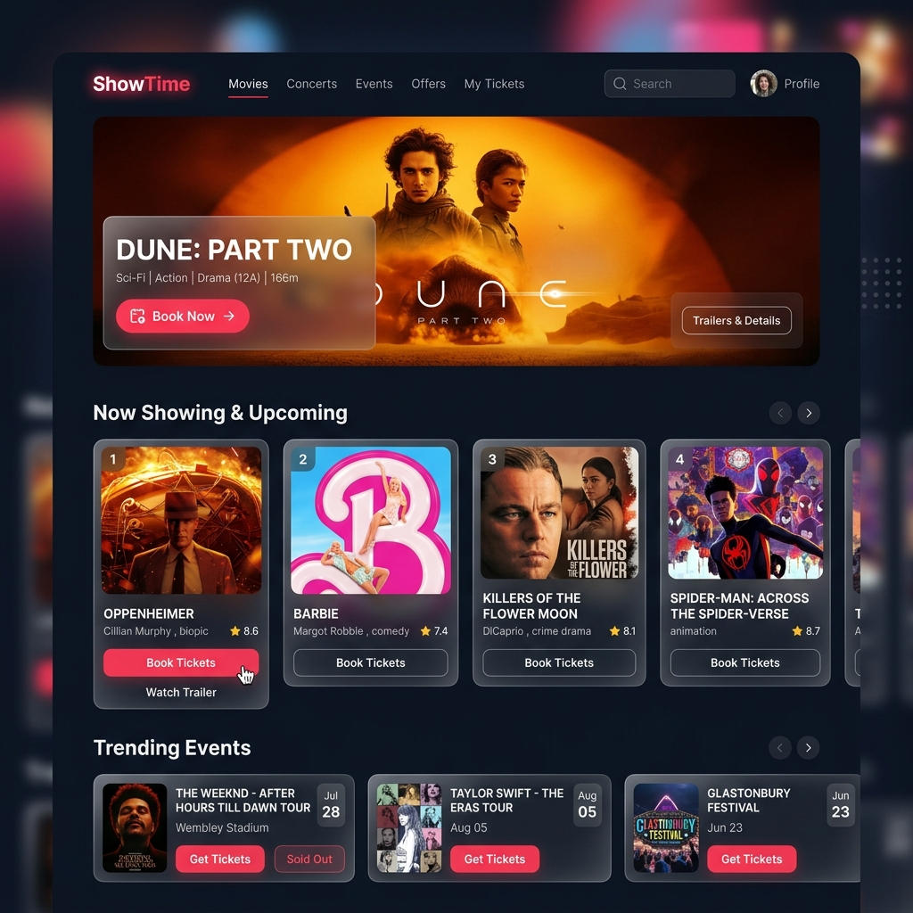
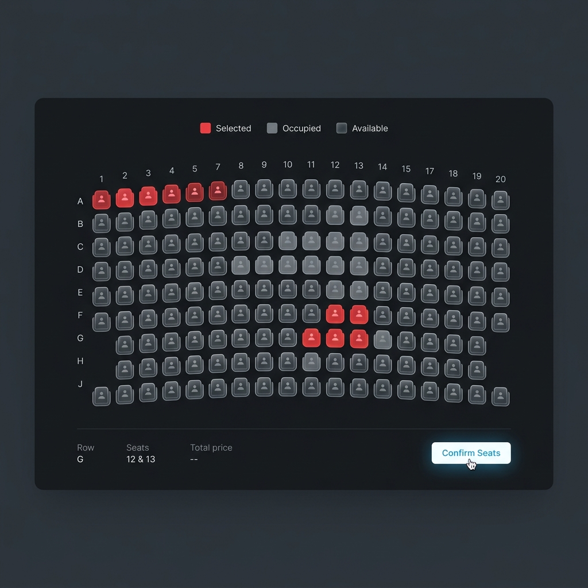
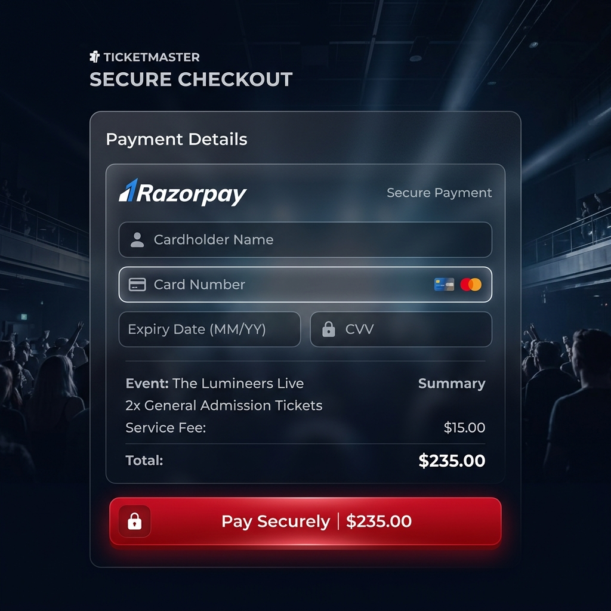

# 🎬 ShowTime: Design System & Wireframes

## 1. Design Philosophy
**ShowTime** follows a modern, premium **Glassmorphism** design aesthetic. The goal was to create an immersive, distraction-free environment for users to discover and book entertainment.

### Key Principles:
- **Depth & Layering:** Using subtle box shadows and semi-transparent backgrounds to create hierarchy.
- **Vibrant Accents:** Utilizing high-contrast colors (like Vibrant Red/Pink) against a Dark Mode palette to draw attention to CTAs.
- **Micro-interactions:** Smooth transitions and hover effects to make the interface feel alive.
- **Mobile-First Responsiveness:** Ensuring that the seat selection and payment flows are seamless on touch devices.

---

## 2. Color Palette
| Purpose | Color | Hex Code |
|---------|-------|----------|
| Primary Background | Deep Charcoal | `#0f172a` |
| Surface/Card | Dark Navy (Semi-transparent) | `rgba(30, 41, 59, 0.7)` |
| Accent | ShowTime Scarlet | `#f43f5e` |
| Text: Primary | Pure White | `#f8fafc` |
| Text: Secondary | Slate Gray | `#94a3b8` |

---

## 3. Typography
- **Headings:** *Outfit* or *Inter* (Sans-serif) - Bold, high tracking.
- **Body:** *Roboto* - Medium weight for better readability.

---

## 4. UI Components

### Navigation Bar
- Glassmorphic top bar.
- Dynamic search input.
- User profile/Login toggle.

### Hero Section
- Large, high-resolution movie posters.
- Gradient overlays for text legibility.
- "Book Now" prominent buttons.

### Event Cards
- Aspect ratio 2:3 for posters.
- Hover scaling effects.
- Metadata (Rating, Genre, Language) displayed as subtle badges.

---

## 5. Wireframes

*Description: The main dashboard layout showing the hero section and categories.*

*Description: The interactive seat grid showing selected and occupied states.*

*Description: Secure checkout form following a clean, centered design.*

---

## 6. Interaction Model
- **Booking Flow:** Search -> Select Event -> Select Date/Time -> Choose Seats -> Secure Payment -> Confirmation Email.
- **Admin Flow:** Metrics Dashboard -> Manage Inventory -> Add/Edit Movie -> Upload Assets.
